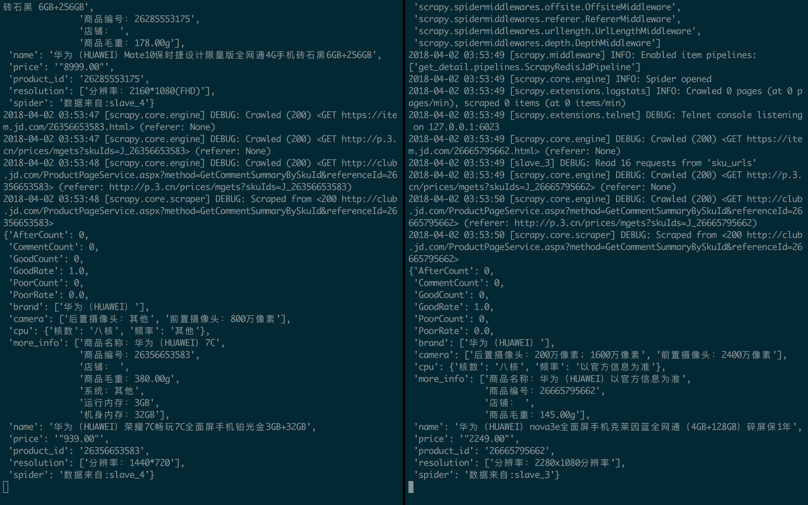

# 自己初学时的网络爬虫仓库
其中包含3部分：
* 网易云音乐的爬虫(爬取网易云音乐某歌单下某用户的所有评论)：使用Requests、XPath、BeautifulSoup等模块实现爬取200万条网易云音乐评论
* 使用 Scrapy 框架的爬虫(爬取京东官网约20000部手机)
* 对从京东官网爬取下来的手机的一个简单的分析

## 爬取网易云音乐歌曲下某用户的评论
**获取某用户(user_id)某歌单()下的所有评论**

**2018年9月更新**: (若需最初我入门Python时的版本,请`ckeck out`至 `17d976a`)
仅供学习入门参考, 为了不给服务器照成不良影响(而不是像最开始那样无脑一秒几百条的爬取, 获取评论的时候每请求一次(获取一页评论) sleep 1 秒,所以,粗略估算效率不到20条(可能17 ,18吧)评论/秒.

**原README.md(2017年10月)**`commit ID: 17d976a`(慎用, 可能被反爬)

这是一个简陋的获取网易云音乐给定歌单的所有评论或找出特定用户在其歌单中的评论的程序。

说明：共有两个.py程序，大体上相同，只有一处不同点————多线程处理的思路上:

### PLAN A：爬取网易云音乐给定歌单或用户的评论(歌曲多线程).py

    思路是先获取给定歌单中的所有歌曲的music_id，然后把music_id进行多线程处理，相当于一次爬取多首音乐的评论，然后再join.

### PLAN B:爬取网易云音乐给定歌单或用户的评论(评论多线程).py

    思路是先获取给定歌单中的所有歌曲的music_id，然后一次处理一个music_id，其后对该music_id下的评论进行多线程处理，相当把该歌曲的评论分为2部分，同时爬取，然后再join

注：PLAN A爬取速度取决于连续3首歌曲中评论数的最大值，实际上要比PLAN B慢。用我电脑爬取时速度大概在**1百万条评论/小时**.

### 预览图

## 京东手机爬取
用Python3.6写的一个简单的分布式爬虫(scrapy, scrapy-redis,docker)

### 描述
1. 在一台电脑上部署scrapy来进行分布式抓取目标网站(也可用2台或多台电脑来部署分布式,参考https://www.cnblogs.com/kylinlin/p/5198233.html)
2. 本机ip地址为172.20.159.232，用来作为redis的master端，docker中的运行的容器作为slave
3. master的爬虫运行get_url爬虫时会把提取到的url放到redis中的数据库中(“sku_urls”)，然后即可在docker容器中运行多个slave(从redis数据中共享sku_urls)下载网页

### 预览图

## 对scrapy爬取的上万部手机结果的数据分析
相对于最原始爬取的json文件,该文件有一处小小的改动--把原来的诸如"'brand':['小米']"改成了"'brand':'小米'",以方便在pandas.DataFrame中更方便的处理

### 预览图
1. 各手机品牌'出镜'率,没想到华为这么抢眼...

2. 把每款手机的好评率按品牌分组聚合后得出的品牌综合好评率:

3. 差评率排行:

4. 各品牌的平均价格(apple和苹果有点瑕疵,没合并,前面有个华为/小米也是):

