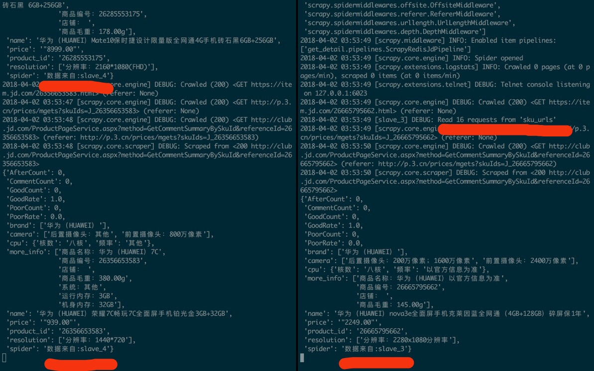

# scrapy_redis_jd
用Python3.6写的一个简单的分布式爬虫(scrapy-redis,docker)

## 描述
1. 在一台电脑上部署scrapy来进行分布式抓取目标网站(也可用2台或多台电脑来部署分布式,参考https://www.cnblogs.com/kylinlin/p/5198233.html)
2. 本机ip地址为172.20.159.232，用来作为redis的master端，docker中的运行的容器作为slave
3. master的爬虫运行get_url爬虫时会把提取到的url放到redis中的数据库中(“sku_urls”)，然后即可在docker容器中运行多个slave(从redis数据中共享sku_urls)下载网页

### 运行图:

### 结果图: (分布在4个 json 文件中)

### requirements
1. python3.6
2. scrapy
3. scrapy-redis
4. docker 

关于docker:
1. 快速入门可参考 https://zhuanlan.zhihu.com/p/23599229?refer=pythoner  
2. 从主机复制文件到容器sudo docker cp host_path containerID:container_path
3. 从容器复制文件到主机sudo docker cp containerID:container_path host_path
