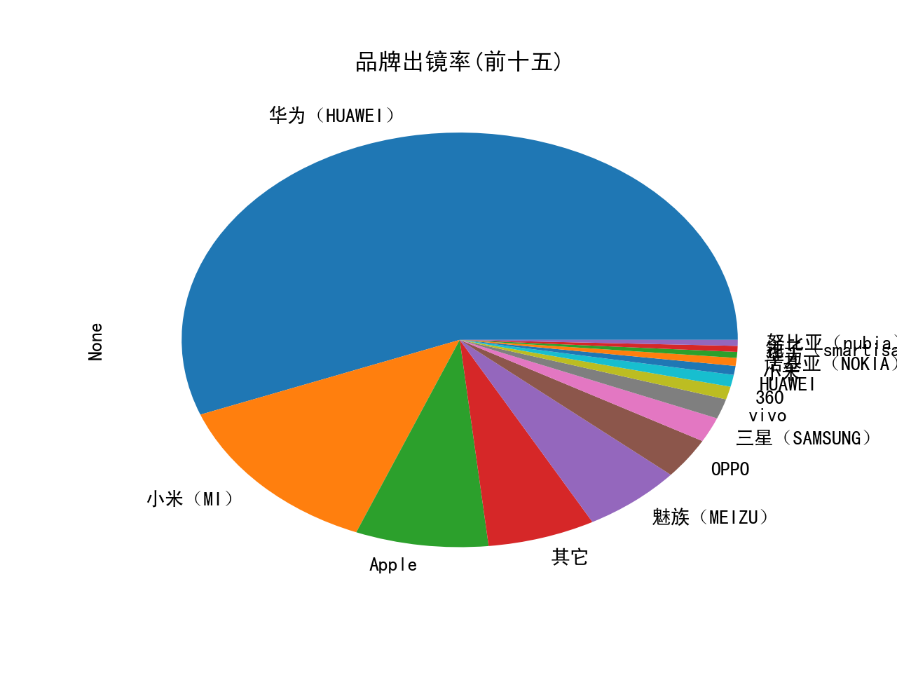
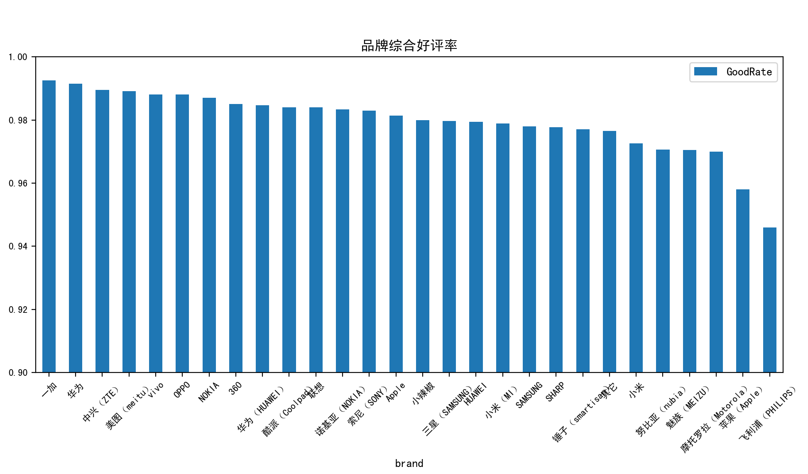
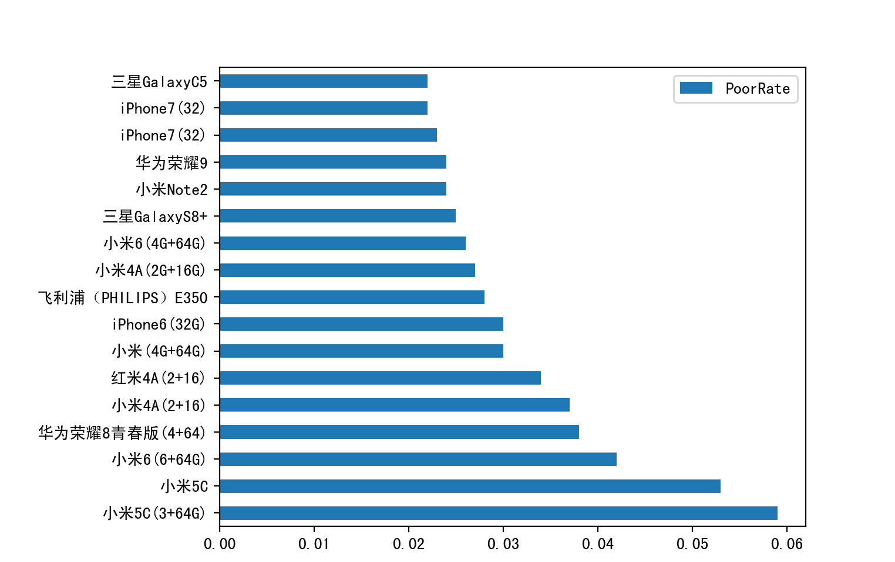
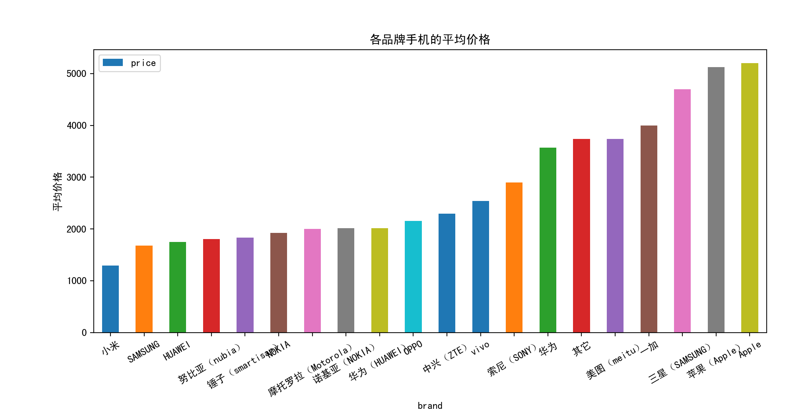

# 对scrapy爬取的上万部手机结果的数据分析
相对于最原始爬取的json文件,该文件有一处小小的改动--把原来的诸如"'brand':['小米']"改成了"'brand':'小米'",以方便在pandas.DataFrame中更方便的处理

示例图:
1. 各手机品牌'出镜'率,没想到华为这么抢眼...

2. 把每款手机的好评率按品牌分组聚合后得出的品牌综合好评率:

3. 差评率排行:

4. 各品牌的平均价格(apple和苹果有点瑕疵,没合并,前面有个华为/小米也是):

